# Docker & Kubernetes Command Guide 🐳⚙️

A friendly, step-by-step guide for common Docker and Kubernetes commands. Perfect for building, deploying, and managing your containerized applications.

---

## 🧠 Introduction to the Kubernetes Cluster

Before we dive in, let's understand the big picture! When we talk about a Kubernetes "cluster," we're talking about a team of computers working together. This team has two main roles:

* **The Master Node 👑**: This is the brain of the cluster. We tell the master what we want our application to look like (our *desired state*), usually by giving it YAML files.
* **Worker Nodes 👷**: These are the machines that do the actual work of running our application containers.

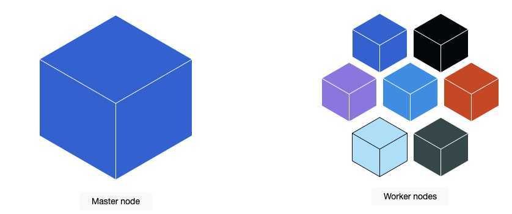

The master's job is to make the cluster's *current state* match our *desired state*. It's always checking and re-checking in a "reconciliation loop." If a pod crashes, the master sees it and tells a worker to start a new one. It's a self-healing system!

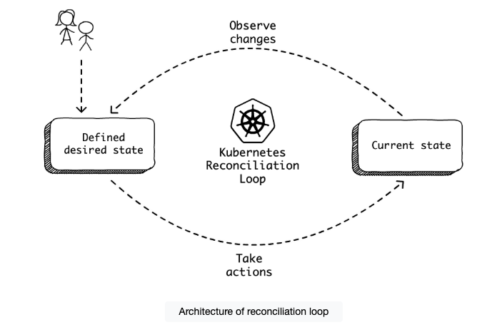
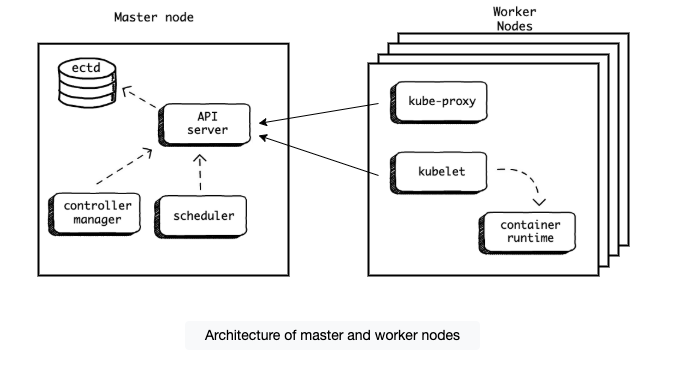

---

## 🏗️ Step 1: Build & Push Your Docker Image

First, we need to package our application into a Docker image and push it to a registry so Kubernetes can access it.

**1. Build the Image**
This command builds the image from the `Dockerfile` in your current directory (`.`) and gives it a memorable name and version tag (`-t`).

```bash
docker build . -t brianstorti/hellok8s:v1
```

**2. Push the Image**
Next, upload your newly built image to a container registry like Docker Hub.

```bash
docker push brianstorti/hellok8s:v1
```

---

## 🚀 Step 2: Deploy to Kubernetes

Now let's get your application running on the Kubernetes cluster.

**Apply a Configuration**
This command tells Kubernetes to create or update resources from a configuration file.

```bash
# The output confirms the resource was created
# deployment.apps/hellok8s created
kubectl apply -f deployment.yaml
```

---

## 🔍 Step 3: Manage & Access Your Deployment

Your app is running! Here are some essential commands for interacting with it.

**List Resources**
Check the status of your resources. Use the `-w` flag to watch for changes in real-time.

```bash
# List all deployments
kubectl get deployments

# List all pods and watch for changes
kubectl get pods -w
```

**Inspect a Pod**
Get detailed information about a specific pod. This is super useful for debugging! You can see events, container status, IP addresses, and more.

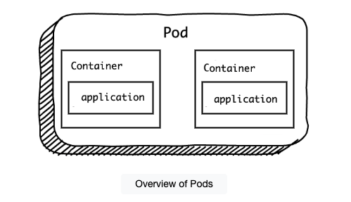
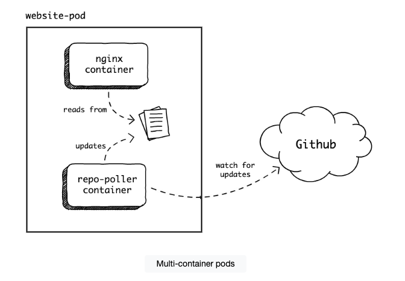

```bash
kubectl describe pod <your-pod-name>
# Example: kubectl describe pod hellok8s-68f47f657c-zwn6g
```

**View Pod Logs** 📄
Stream the logs from a container within a pod. This is crucial for seeing what your app is doing or why it's failing.

```bash
kubectl logs --follow <your-pod-name>
# Example: kubectl logs --follow nginx
```

**Run Commands in a Container** 💻
Execute a command directly inside a running container. Use `-it` for an interactive shell session, which is like SSHing into your container.

```bash
# Run a single command
kubectl exec <your-pod-name> -- <command>
# Example: kubectl exec nginx -- ls /app

# Get an interactive shell inside the container
kubectl exec -it <your-pod-name> -- bash
```

**Port Forwarding** 🔌
Access your application on your local machine without exposing it to the internet. This is perfect for testing and development.

```bash
# Forward local port 3000 to pod's port 80
kubectl port-forward pod/<pod-name> 3000:80

# Allow remote access (from your network)
kubectl port-forward --address 0.0.0.0 pod/<pod-name> 3000:80
```

**Delete Resources** 🗑️
Remove resources from your cluster.

```bash
# Delete a specific pod by name
kubectl delete pod <your-pod-name>

# Delete all resources defined in a YAML file
kubectl delete -f nginx.yaml
```

---

## 🔄 Step 4: Update & Rollback Your Application

Time to release a new version! Here's how to manage updates and roll back if something goes wrong.

### Deployment Strategies

* **Rolling Update (Default)**: This strategy ensures zero downtime by gradually replacing old pods with new ones. For a moment, both v1 and v2 will be running together.
    * `maxSurge`: How many *extra* pods can be created during the update.
    * `maxUnavailable`: How many old pods can be *missing* during the update.
    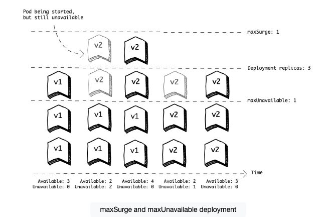

* **Recreate Strategy**: This strategy terminates all old pods *before* creating new ones. This causes a short downtime but guarantees that v1 and v2 never run at the same time.
    ```yaml
    # In your deployment.yaml
    spec:
      strategy:
        type: Recreate
    ```
    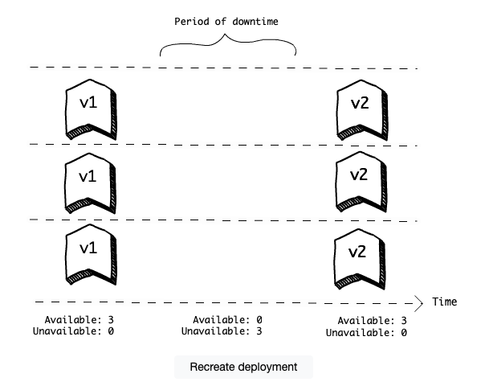

### Rollback a Deployment
Did the new version introduce a bug? No problem! You can quickly revert to the previous stable version.

```bash
kubectl rollout undo deployment hellok8s
```

---

## ❤️ Step 5: Health Checks & Services

Let's make our application robust and accessible to the world.

### Health Checks: Liveness & Readiness Probes

Kubernetes can automatically check if your application is healthy and ready to receive traffic.

* **Readiness Probe ✅**: Prevents traffic from being sent to a pod until it's fully ready (e.g., a database connection is established). If the probe fails, Kubernetes just waits patiently.
    > *Probe failed: Readiness probe failed with statuscode: 500*
    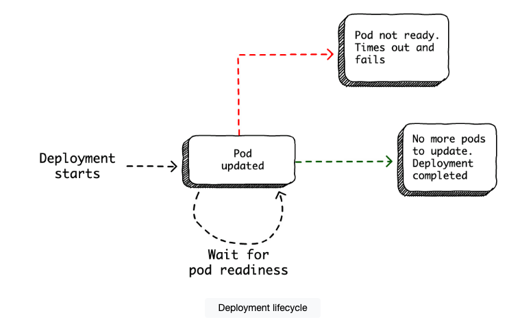

* **Liveness Probe 🩺**: Periodically checks if your application is still healthy. If the liveness probe fails, Kubernetes will restart the container, attempting to fix the issue automatically.

### Exposing Pods with a Service

A **Service** is a crucial Kubernetes resource that gives us a single, stable network endpoint (a consistent IP address and DNS name) for a group of pods. It sits in front of the pods and acts like a traffic cop, load balancing requests among all the healthy pods behind it.

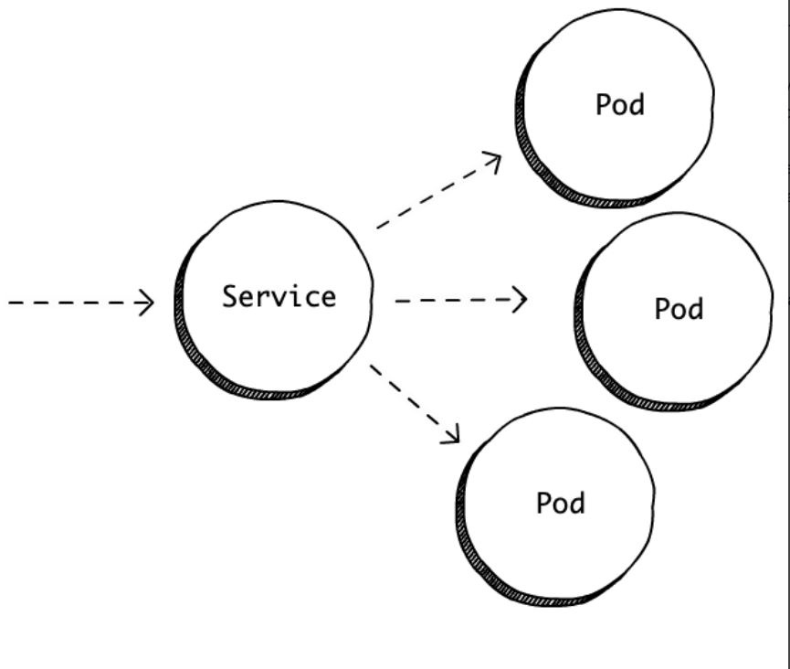

You create a service using a YAML file, just like a deployment:
```bash
kubectl apply -f service.yaml
```

And you can check its status:
```bash
kubectl get service hellok8s-svc
```

Let's explore the different types of Services:

#### 1. ClusterIP (Default)
This is the most basic service type and the default if you don't specify one. It's used for **internal cluster communication only**. If `app-a` needs to talk to `app-b` inside the cluster, a ClusterIP service provides a stable, private address for `app-b`.

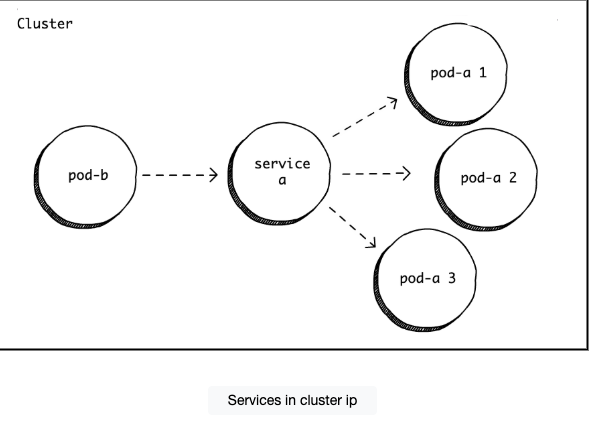

```bash
# Check the internal IP address of the service
kubectl get service
# NAME            TYPE        CLUSTER-IP
# clusterip-svc   ClusterIP   10.105.223.250
```

#### 2. NodePort
This service type is perfect for exposing your application to the **outside world** for development or testing. It builds on top of `ClusterIP` by opening a specific port on *all* worker nodes. Any traffic sent to that port on any node gets forwarded to your application's pods.

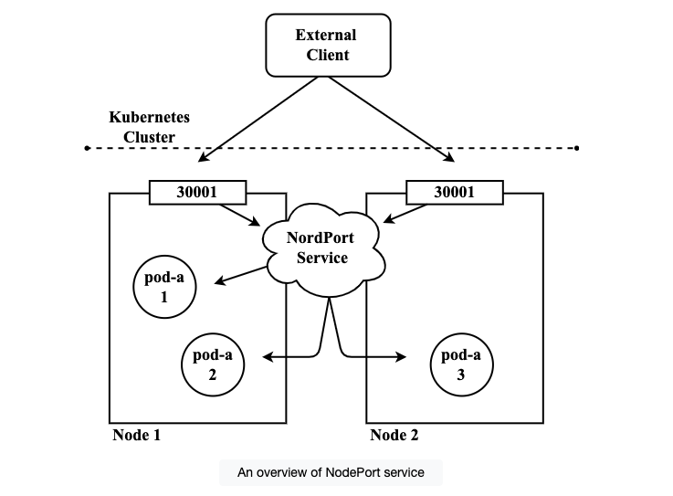

```bash
# You can now access your app from outside the cluster
curl http://<any-node-ip>:<node-port>
# Example: curl http://localhost:30001
# [v3] Hello, Kubernetes, from hellok8s-7f4c57d446-t9ngx!
```

#### 3. LoadBalancer
This is the most powerful and production-ready service type. It builds on `NodePort` and automatically provisions a **cloud load balancer** (like an AWS Elastic Load Balancer or Google Cloud Load Balancer) for you. This gives you a single, highly available IP address to access your application from the internet.

The cloud provider's load balancer handles distributing traffic to the `NodePort` on your worker nodes, which then routes it to your pods.

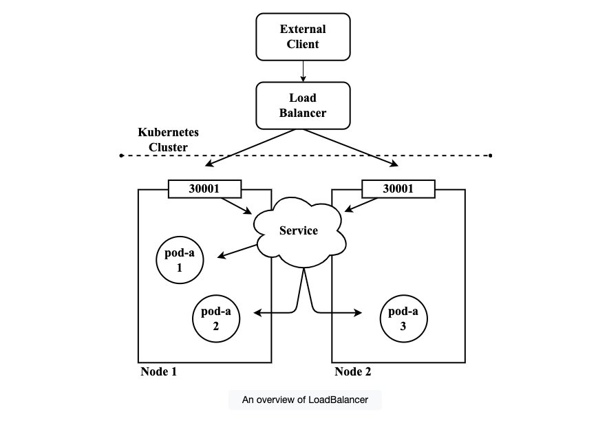

**Note:** The `LoadBalancer` type is the easiest way to expose an application, but it provisions a new load balancer for *every service*, which can get expensive. For managing multiple services through one load balancer, you'll want to look into the **Ingress** resource later on.

#### 4. ExternalName
This service type is a bit different. Instead of pointing to pods inside your cluster, it acts as an alias for an **external service** by returning a `CNAME` record.

For example, let's say your application needs to connect to a database hosted outside Kubernetes at `my-db.company.com`. Instead of hardcoding this address in your app, you can create an `ExternalName` service.

```yaml
# external-name-service.yaml
apiVersion: v1
kind: Service
metadata:
  name: db-service
spec:
  type: ExternalName
  externalName: my-db.company.com
```

Now, your pods can simply connect to `db-service`, and Kubernetes DNS will automatically resolve it to `my-db.company.com`. If the database address ever changes, you only need to update the service, not all of your applications!

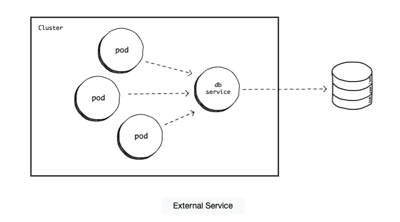

---

## 🛠️ Useful Tools

**Install `watch`** 👀
A fantastic tool for monitoring changes in real-time by running a command repeatedly.

```bash
# On macOS with Homebrew
brew install watch

# Example: Watch your pods every 2 seconds
watch -n 2 kubectl get pods
```

---

## 📝 Recap

Let's review what we've learned:

* **Deployments**: High-level resources that manage pods for us, making scaling easy.
* **Rollout Strategies**: We can use `RollingUpdate` (default, zero downtime) or `Recreate` (downtime, but simpler).
* **Health Probes**: `readinessProbe` ensures a pod is ready for traffic, while `livenessProbe` ensures a running container is still healthy.
* **Services**: Give us a stable endpoint to access our pods. `ClusterIP` is for internal traffic, `NodePort` is for simple external access, `LoadBalancer` is for production-grade external access, and `ExternalName` creates a local alias for an external service.
